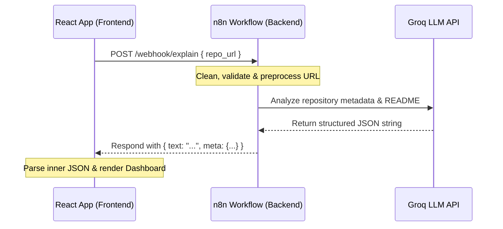
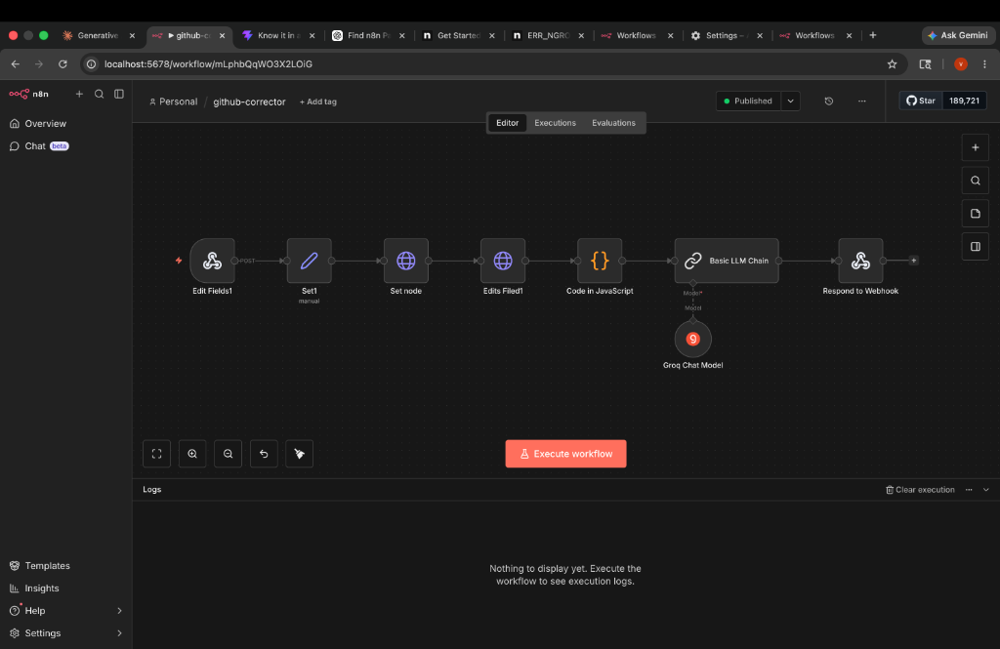

# ⚡ Know it in a Click

**Know it in a Click** is a modern, premium AI-powered dashboard designed to provide an instant, comprehensive breakdown of any GitHub repository in a single click. Instead of digging through thousands of lines of source code or dry documentation, users simply paste a GitHub URL to receive an interactive, visual index of the project.

---

## 🎨 Features & Highlights

- **Instant AI Summary**: High-level repository descriptions detailing the project's purpose.
- **Problem Statement Solver**: Highlights exactly what pain points the repository solves.
- **System Architecture Table**: Maps key files and directories to their specific roles in the codebase.
- **Interactive Tech Stack Badges**: Dynamically themed and color-coded technology badges.
- **Complexity / Difficulty Gauge**: Evaluates if the codebase is Beginner, Intermediate, or Advanced.
- **Contribution Index**: Detects whether welcoming `good first issues` are active.
- **Fun Facts & Trivia**: Lighthearted AI-generated insights and repository facts.
- **Premium Dark Aesthetics**: Styled with a cohesive, responsive GitHub-inspired dark interface.

---

## 🏗️ System Architecture & Data Flow



1. **Frontend Request**: The React client cleans the input URL (strips trailing `.git` suffixes), validates the formatting, and sends a POST request with the `repo_url` payload to the n8n webhook backend.
2. **Backend Processing**: The n8n workflow receives the payload, extracts repo metadata, preprocesses the inputs, and invokes the Groq Chat Model through an LLM Chain to perform an intelligent analysis.
3. **Response Parsing**: The webhook replies with a nested, stringified JSON payload. The React client safely parses the inner string, logs the output for developer inspection, and binds the data to custom UI components.

---

## ⚙️ n8n Backend Workflow Explained

The n8n backend runs a robust pipeline named `github-corrector` to retrieve, clean, analyze, and return the repository breakdown. Below is a visual representation of the active workflow:



### Node-by-Node Pipeline Breakdown

| Node Name | Node Type | Role in Workflow |
| :--- | :--- | :--- |
| **Edit Fields1 (Webhook)** | Webhook Trigger | Exposes the POST endpoint (`/webhook/explain`) to receive the input `repo_url` payload from the React client. |
| **Set1 (manual)** | Set / Edit Data | Initializes default state parameters and sets manual placeholder values for development testing. |
| **Set node** | Set / Edit Data | Normalizes the input repository parameters (e.g. separates the repository owner and name from the URL path). |
| **Edits Filed1** | Set / Edit Data | Prepares and injects environment variables, helper configs, or context parameters required by subsequent nodes. |
| **Code in JavaScript** | JavaScript Code | Executes inline JS logic to validate the structured data, perform cleanup steps, and format parameters for the LLM. |
| **Basic LLM Chain** | LangChain / Chain | Orchestrates the prompt template and binds variables (like repo name, README content, and stats) before querying the LLM. |
| **Groq Chat Model** | LLM Provider (Model) | Feeds into the LLM Chain to serve as the AI engine, analyzing the repository's source files and generating a structured JSON summary. |
| **Respond to Webhook** | Webhook Response | Sends the final payload—containing the AI-generated stringified JSON in the `"text"` field and general repository metadata in `"meta"`—back to the React application. |

---

## 🚀 Getting Started

### Prerequisites

Ensure you have **Node.js** (v18+) and **npm** installed.

### Installation

1. Clone the repository and navigate to the project directory:
   ```bash
   cd Know-it-in-a-click
   ```

2. Install the frontend dependencies:
   ```bash
   npm install
   ```

3. Configure the environment variables:
   Create a `.env` file in the root directory (or set it in your environment) to specify your n8n workflow API endpoint:
   ```env
   VITE_API_URL=http://localhost:5678/webhook/explain
   ```

4. Run the development server:
   ```bash
   npm run dev
   ```

---

## 🧪 Testing Locally

To verify all components load correctly, you can test the explainer with these public, standard repositories:
- `https://github.com/axios/axios`
- `https://github.com/facebook/react`
- `https://github.com/torvalds/linux`
